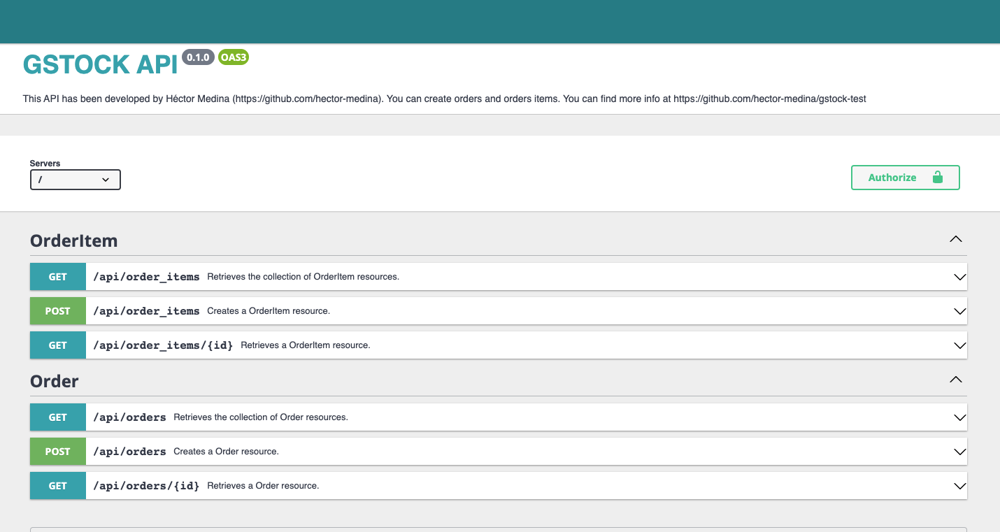

# GSTOCK-TEST

This repository contains an API with the specs asked for a vacancy in gstock. 

The infrastucture has been developed as follows:
- gstock_api: API container.
- gstock_db: MySQL database.
- gstock_phpmyadmin: phpMyAdmin client for MySQL database.

## Demo API

You can find a demo APi at http://hectormedina.es/api

## Installation.

In order to install the API, you should follow the next steps:

### 1. Clone this repository.

```sh
git clone https://github.com/hector-medina/gstock-test.git
```

### 2. Get into the project's folder.

```sh
cd gstock-test
```

### 3. Run the container.

This command will create three containers: api, MySQL database and phpMyAdmin containers. 

```sh
docker-compose up -d
```

### 4. Install dependencies.

You should run a command inside the container. To do so, first you have connect to it:
```sh
docker exec -it gstock_api bash
```

And then you can install dependencies with composer:
```sh
composer install
```

### 5. Synchronize API with database.

To make sure everything will work, we have to update database schema in according with API entities. To do so, run the
following commands in the container.
```sh
php bin/console make:migration
php bin/console doctrine:migrations:migrate
```
Note that the last command could fail, I haven't had time to fix it. It happens because it tries to create the same table twice. 

### 6. Visit your site.

Now you are able to access your site by typing, but there are currently two enviroment exposed
- http://localhost:80 or http://localhost : API production environment
- http://localhost:8080 : phpMyAdmin client (user: admin, password: gstock_api)

## Usage

In order to use the API, there is available a comfortable view in http://localhost/api



### Insert an Order.

An order consist of a purchase, you can populate this order with order items once you have been created the order.

In order to create de order, send a post request as follow:
```sh
Headers
- Application : application/json

Body
{
  "date": "2022-01-20",
  "comment": "This is my first order"
}

Endpoint: localhost/api/orders

Method: POST
```

The response will look like this;
```sh
{
    "@context": "/api/contexts/Order",
    "@id": "/api/orders/ef72534e-500c-4204-a926-ae6adf358be5",
    "@type": "Order",
    "reference": "ef72534e-500c-4204-a926-ae6adf358be5",
    "date": "2022-01-20T00:00:00+00:00",
    "comment": "This is my first order",
    "orderItems": [],
    "subtotal": "0",
    "numberOfItems": "0",
    "tax": "0",
    "total": "0",
    "discountAmount": "0",
    "discountPercentage": "0"
}
```
### Insert items in an Order.

You can now populate the order with items.
```sh
Headers
- Application : application/json

Body
{
  "product": "Caramelos",
  "quantity": "3",
  "price": "1.5",
  "discountPercentage": "2",
  "tax": "21",
  "parentOrder": "/api/orders/ef72534e-500c-4204-a926-ae6adf358be5"
}

Endpoint: localhost/api/order_items

Method: POST
```

The response will look like this;
```sh
{
    "@context": "/api/contexts/OrderItem",
    "@id": "/api/order_items/2",
    "@type": "OrderItem",
    "id": 2,
    "product": "Caramelos",
    "quantity": "3.00",
    "price": "1.50",
    "discountPercentage": "2.00",
    "taxPercentage": "21.00",
    "parentOrder": "/api/orders/ef72534e-500c-4204-a926-ae6adf358be5",
    "baseTax": "4.5",
    "discountAmount": "0.09",
    "taxAmount": "0.93",
    "total": "5.34"
}
```

### Query a list of Orders.

You can query a list of orders making a get request as follows:
```sh
Headers
- Application : application/json

Endpoint: localhost/api/orders?page=1'

Method: GET
```

The response will look like this;
```sh
{
    "@context": "/api/contexts/Order",
    "@id": "/api/orders",
    "@type": "hydra:Collection",
    "hydra:member": [
        {
            "@id": "/api/orders/3a697092-2623-450a-8a8d-6cc2643453e8",
            "@type": "Order",
            "reference": "3a697092-2623-450a-8a8d-6cc2643453e8",
            "date": "2022-01-15T00:00:00+00:00",
            "subtotal": "0",
            "numberOfItems": "0",
            "tax": "0",
            "total": "0",
            "discountAmount": "0",
            "discountPercentage": "0"
        },
        {
            "@id": "/api/orders/491b731e-6247-47a3-b26e-93347752ea36",
            "@type": "Order",
            "reference": "491b731e-6247-47a3-b26e-93347752ea36",
            "date": "2022-01-15T00:00:00+00:00",
            "subtotal": "2020.08",
            "numberOfItems": "1",
            "tax": "390.28",
            "total": "2248.75",
            "discountAmount": "161.61",
            "discountPercentage": "8"
        },
        {
            "@id": "/api/orders/d9e8d6e1-2e51-4408-a958-abee04d932ba",
            "@type": "Order",
            "reference": "d9e8d6e1-2e51-4408-a958-abee04d932ba",
            "date": "2022-01-16T00:00:00+00:00",
            "subtotal": "0",
            "numberOfItems": "0",
            "tax": "0",
            "total": "0",
            "discountAmount": "0",
            "discountPercentage": "0"
        },
        {
            "@id": "/api/orders/ef72534e-500c-4204-a926-ae6adf358be5",
            "@type": "Order",
            "reference": "ef72534e-500c-4204-a926-ae6adf358be5",
            "date": "2022-01-20T00:00:00+00:00",
            "subtotal": "4.5",
            "numberOfItems": "1",
            "tax": "0.93",
            "total": "5.34",
            "discountAmount": "0.09",
            "discountPercentage": "2"
        }
    ],
    "hydra:totalItems": 4
}
```
